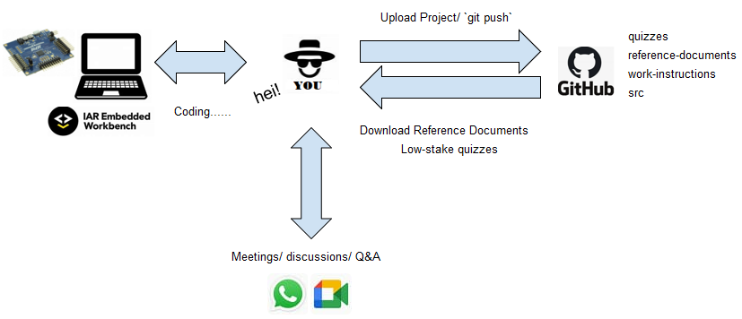
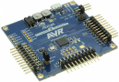
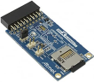
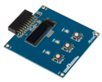
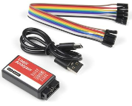

# Summer Internship

## Agenda

Week 1

- Refresh your knowledge on C programming, micro controllers, electronics
- Build your first project/program code
- Working with LEDs and programming GPIO
- Building a control panel

Week 2

- Working with ADC
- Working with Timers

Week 3

- Working with PWM signals
- Serial communication UART
- Further development activities you can do (maybe you want to buy your own dev kit for personal projects)
- Conclusions and Feedback

## Workflow



## Hardware super-kit

Each participant will receive a hardware `super-kit` comprising:

- 1x Development Board Kit comprising:
  - 1x ATmega324PB development board 
  - 1x IO extension board 
  - 1x OLED extension board 
  - 1x USB cable (type micro-B) 
- 1x Logic Analyzer Kit comprising:
  - 1x Logic Analyzer box 
  - 1x USB cable (type C)
  - 5x wires type `mother-mother`

Please return the hardware `super-kit` at the end of the Internship! Synch-up with your instructor to receive and return the `super-kit`!

## Project organization

Each participant will organize the project on his local computer under the following mandatory (!) folder structure (Please respect the **C:/** path shown below! Do not change it!).  

**Step 1**: create the following directory on your local machine

```text
C:/MQ_Summer_Internship
```

**Step 2**: when you will download from GitHub the repositories, you will save them under the above directory. Therefore the folder structure will finally look like this:

```text
C:/MQ_Summer_Internship
    |- Project
    |- Reference_Documents
```

The Work Instructions have an hierarchical numbered structure of Goals-Objectives-Exercises (e.g. 123 means Goal no.1, Objective no.2, Exercise no.3).  
The goal is the broader weekly frame you want to develop yourself in and this cannot be achieved without having defined objectives.  
Finally, you know you have accomplished an objective by doing its exercises.  
Some of the objectives/exercises are optional (they are marked accordingly) so that all different individual study paces are covered.  

## Meetings

### Team meetings

There will be a weekly standard meeting for team synchronization (established on a majority common agreement), on Google Meet (synch-up with your instructor for exact hour).  
Typically we will discuss about the objectives and exercises you have to do, clarify requirements and concepts. Duration is variable, usually takes 1-2h.  
During the days you will have your time to study and practice based on the defined objectives. You should concentrate yourself on delivering results. For blocking situations you can ask your instructor also outside the meetings.  
Additionally, a communication **WhatsApp group** will be created, therefore you can also ask your colleagues there.  

### 1:1 meetings

There will be also a 45 min weekly personal meeting (the so called 1:1 meetings) with your instructor to check your progress. Typically you should present your progress, receive feedback. The code will be shared via GitHub platform. You will receive access rights from your instructor.

## Timeline

Starts Monday 6th July 2026  
Ends Friday 24th July 2026  
