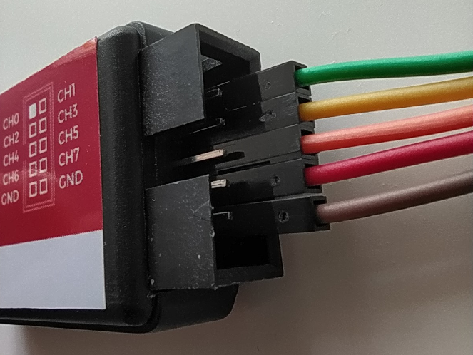
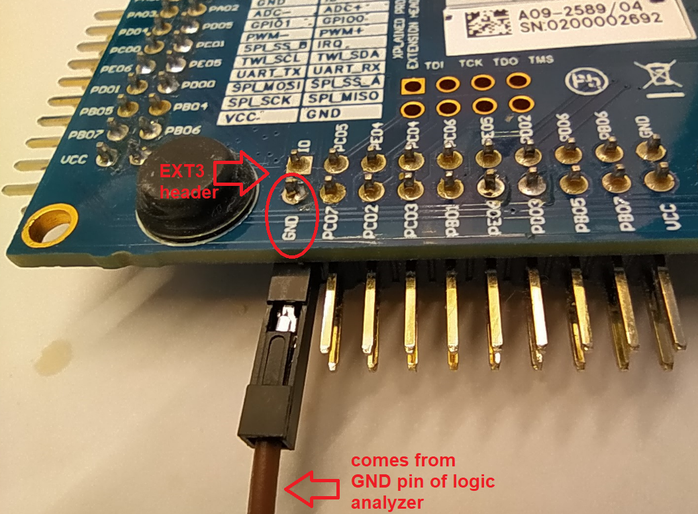
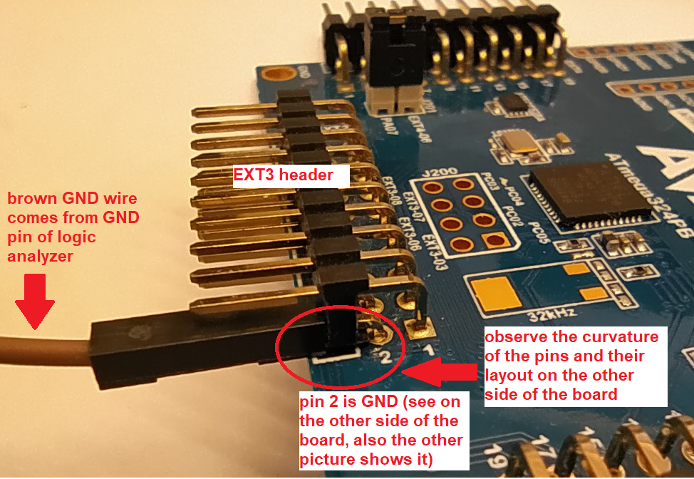
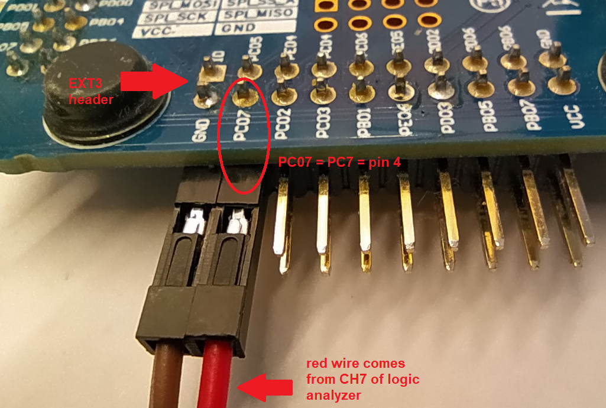
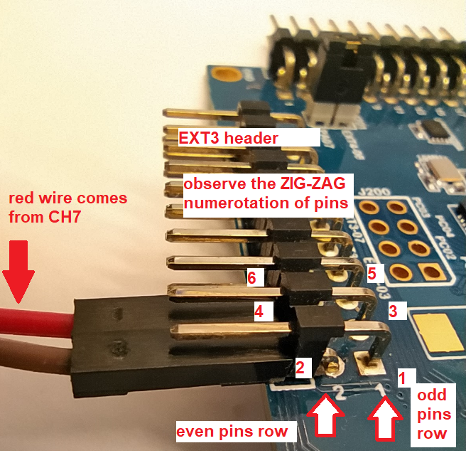

# How to work with Logic Analyzer (example for LED0 exercise)

## 1. Hardware connection

1. Cables connection must be done when the analyzer is **not powered**.
2. Use this convention for the ribbon cable so usage stays standard across exercises.

Use only odd channels: **CH1, CH3, CH5, CH7**.

Color legend:
- CH1 = green
- CH3 = yellow
- CH5 = orange
- CH7 = red
- GND = brown

The odd channels are on the bottom pin row (as shown in the picture above).

For details about the analyzer model, see [USB Logic Analyzer - 24MHz/8-Channel - SparkFun Electronics](https://www.sparkfun.com/products/18627).

### 1.2 Connect GND

Ground (GND) wire must be connected to a GND pin on the main development board.

For this setup, use **pin 2 (GND) from EXT3 header** because this header is left open/unplugged.

Back view:

Front view:

### 1.3 Connect LED0 signal (PC7)

LED0 is connected to pin **PC7**. One logic analyzer channel must be connected to this pin to record the electrical signal applied to LED0.

Reference mapping from the guide: **pin PC7 = PC07 = pin 4**.

Back view:

Front view:

## 2. PulseView software

Read and follow this guide to install and use PulseView:

[Using the USB Logic Analyzer with sigrok PulseView - SparkFun Learn](https://learn.sparkfun.com/tutorials/using-the-usb-logic-analyzer-with-sigrok-pulseview?_ga=2.64227945.73012815.1687355124-734603234.1675385341)
