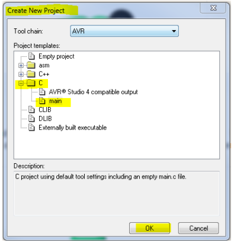
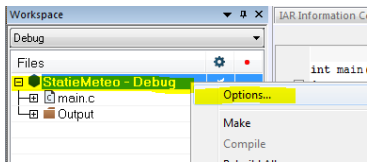
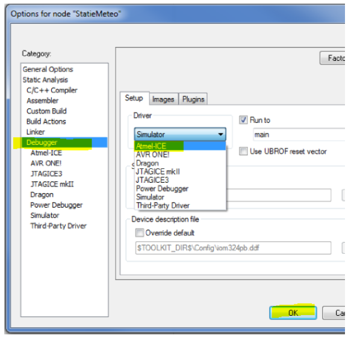

# New Project Tutorial with IAR

This page contains the internship Guide sheet section on creating a new project in IAR Embedded Workbench.

## Create a new AVR project

1. Connect the ATmega324PB board to your PC with USB.
1. Confirm the board power LED is on.
1. Open IAR Embedded Workbench.
1. Create a new project from the menu:
   - Project -> Create New Project -> C -> main -> OK

1. Save the project file (`.ewp`) inside your project folder.
1. Save all so IAR also creates/saves the workspace file (`.eww`).
   - A workspace can contain multiple projects.
1. Open project options and configure these settings:
   - General Options -> Target -> Processor Configuration -> ATmega324PB
   - Debugger -> Atmel-ICE (do not select Simulator)
   - C/C++ Compiler -> Optimizations -> Level -> None

1. You are ready to write code, build, download, run, and debug.
