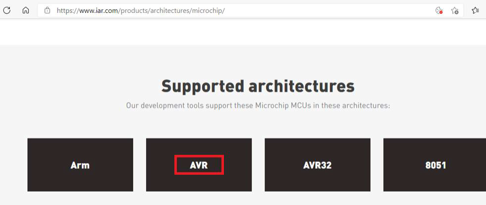
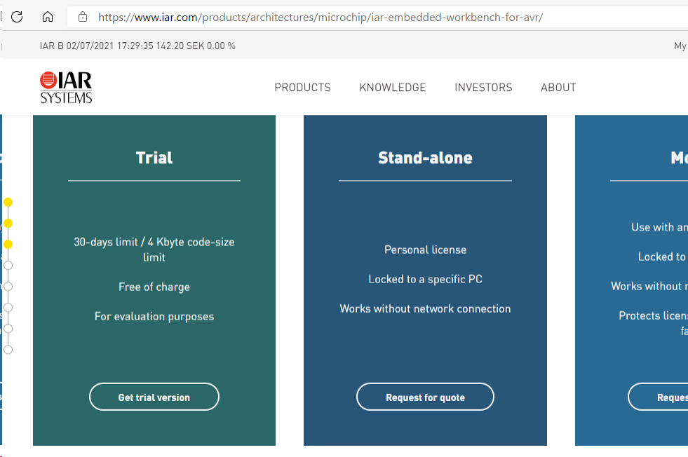
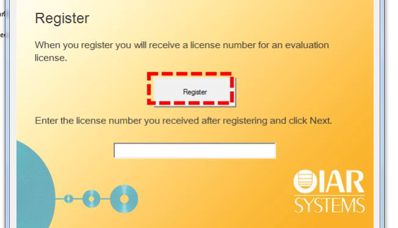
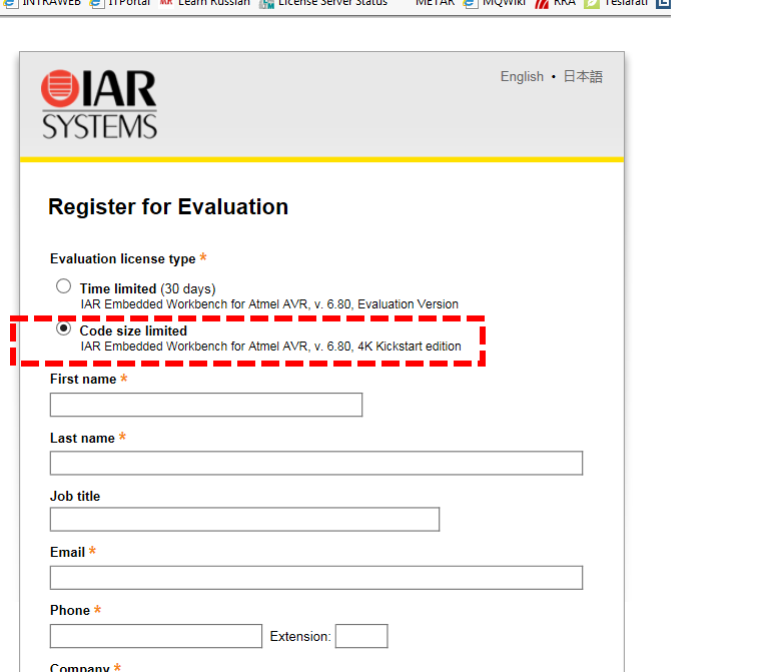

# Setup IAR Embedded Workbench (AVR)

This page contains the IAR installation flow from the internship guide workbook.

## Install IAR Embedded Workbench

1. Go to the IAR website and open the Products section.

1. Scroll to supported architectures and choose AVR.

1. Continue until you reach the trial version section and choose the trial download flow.

1. During installation and first run, choose to register for an evaluation license.

1. On the evaluation registration page, choose the code-size-limited 4K option.

1. Check your email, copy the received license code, and complete activation in IAR.

After this, IAR Embedded Workbench is ready for internship projects.

## Notes

- Be careful to pick the AVR variant of Embedded Workbench.
- Do not choose another evaluation tier by mistake; use the 4K code size option.
