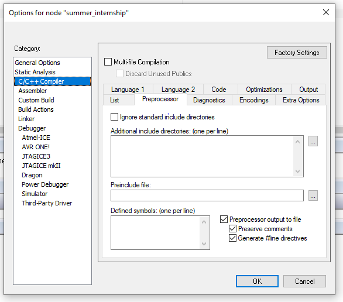

# Week: 1 - Goal : 1

## Objective 5: Refresh your C programming language know-how

### Task Checklist & Results

| Task ID | Type | Status / Deliverable |
| :--- | :--- | :--- |
| **[151]** | `CORE` | [x] Completed |
| **[152]** | `CORE` | [x] Completed |
| **[153]** | `CORE` | [x] Completed |
| **[154]** | `CORE` | [x] Completed |

#### Task [151]
> **Question/Prompt:**     How to handle the different numeration systems (binary, decimal, hexadecimal). Watch the materials below, then: are you able to create a single question for testing your colleague's knowledge on these topics? The question you create will be used later to build up a quiz for the students group and must be of type "multiple choices - single answer" or "true-false" (include the correct answer also)

> **Answer/Explanation:**
> How do we find the 2's complement of a number? (single answer) 
 
> We write the absolute binary representation of the number, then we invert the bits and lastly we add one to the inverted number.

---

#### Task [152]
> **Question/Prompt:**    In the program code above insert comments explaining what the program does (sum up two numbers). The preprocessor will output files with extension .i. Check how the preprocessor works using the settings showed. Visualize the .i files and observe how the code comments are preprocessed for your main.c file.

> **Answer/Explanation:**
> The .i files are obtained during the compilation stage, precisely after the preprocessing stage.
> They are usually deleted after the compilation stage finishes, so in order to view them I have checked the following settings in the Compiler section of the IDE:

> The preprocessor strips any comments and expands directives, so the .i file that results will have no comments. To be able to see what comments where in the source file the `Preserve comments` box can be checked. 
 
> Besides the code and the comments from the source file (this being the case when the box was checked), this line is added during the preprocessing stage:
 
    - #line 1 "absolute path to the source file", which is a result of the `Generate #line directives` option and it used for error reporting and debugging

---

#### Task [153]
> **Question/Prompt:**    Now you must delete the code from the previous exercise in IAR EW (because the exercises are not linked together). For the code below, what value will have the VAR constant? (you can easily see this if you store the VAR into a variable and look at main.i preprocessed file)

> **Answer/Explanation:**
> The value of the VAR constant is 5, because MAX is not defined anywhere in the source code. In this case the preprocessor evaluates it as 0.
> Since ` 0 == 1` is false, the `#else` branch is triggered.

---

#### Task [154]
> **Question/Prompt:**    What this code will do?

> **Answer/Explanation:**
> This code defines a constanst MAX equal to 10, then redefines it to 55. The x variable is assigned 2, and after the constant redefinition it is assigned the value 55.

---