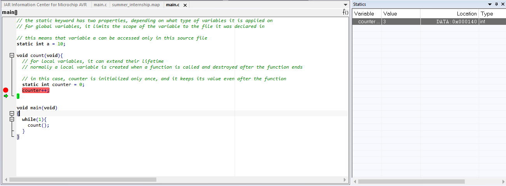

# Week: 1 - Goal : 1


## Objective 5: Refresh your C programming language know-how

### Task Checklist & Results

| Task ID   | Type      | Status / Deliverable 
| :---      | :---      | :--- 
| **[151]** | `CORE`    | [x] Completed 
| **[152]** | `CORE`    | [x] Completed 
| **[153]** | `CORE`    | [x] Completed 
| **[154]** | `CORE`    | [x] Completed 
| **[155]** | `CORE`    | [x] Completed 
| **[156]** | `STRETCH` | [x] Completed 
| **[157]** | `STRETCH` | [x] Completed 
| **[158]** | `STRETCH` | [x] Completed 
| **[159]** | `STRETCH` | [x] Completed 

---

#### Task [151]
> **Question/Prompt:**     How to handle the different numeration systems (binary, decimal, hexadecimal). Watch the materials below, then: are you able to create a single question for testing your colleague's knowledge on these topics? The question you create will be used later to build up a quiz for the students group and must be of type "multiple choices - single answer" or "true-false" (include the correct answer also)

> **Answer/Explanation:**
> How do we find the 2's complement of a number? (single answer) 
<br>
> We write the absolute binary representation of the number, then we invert the bits and lastly we add one to the inverted number.

---

#### Task [152]
> **Question/Prompt:**    In the program code above insert comments explaining what the program does (sum up two numbers). The preprocessor will output files with extension .i. Check how the preprocessor works using the settings showed. Visualize the .i files and observe how the code comments are preprocessed for your main.c file.

> **Answer/Explanation:**
> The .i files are obtained during the compilation stage, precisely after the preprocessing stage.
> They are usually deleted after the compilation stage finishes, so in order to view them I have checked the following settings in the Compiler section of the IDE:


> The preprocessor strips any comments and expands directives, so the .i file that results will have no comments. To be able to see what comments where in the source file the `Preserve comments` box can be checked. 
<br>
> Besides the code and the comments from the source file (this being the case when the box was checked), this line is added during the preprocessing stage:
<br>
    - #line 1 "absolute path to the source file", which is a result of the `Generate #line directives` option and it used for error reporting and debugging

---

#### Task [153]
> **Question/Prompt:**    Now you must delete the code from the previous exercise in IAR EW (because the exercises are not linked together). For the code below, what value will have the VAR constant? (you can easily see this if you store the VAR into a variable and look at main.i preprocessed file)

```
#if MAX == 1
#define VAR 4
#else
#define VAR 5
#endif
```

> **Answer/Explanation:**
> The value of the VAR constant is 5, because MAX is not defined anywhere in the source code. In this case the preprocessor evaluates it as 0.
> Since ` 0 == 1` is false, the `#else` branch is triggered.

---

#### Task [154]
> **Question/Prompt:**    What this code will do?

```
#define MAX 10
void main (void)
{
int x=2;
#define MAX 55
x=MAX;
}
```

> **Answer/Explanation:**
> This code defines a constanst MAX equal to 10, then redefines it to 55. The x variable is assigned 2, and after the constant redefinition it is assigned the value 55.

---

#### Task [155]
> **Question/Prompt:**    What this code will do? Verify it by checking the .i preprocessed file.

```
#define MAX 100
void main (void)
{
int MAX = 10;
}
```

> **Answer/Explanation:**
> This code defines a constanst MAX equal to 100. When running the program, it will throw a compilation error. 
> In the preprocessing stage, the preprocessor will replace the word MAX with the defined value of 100.
> This is what the output of preprocessing looks like:

```
void main ( void ){
  int 100 = 10;
}
```

> The compiler does not expect a number as a variable name, so it throws the `Expected an identifier` error.

---

#### Task [156]
> **Question/Prompt:**     How the following code will work? Verify it in your main.c file by comparing it with main.i (the preprocessed file).

```
#define MAX(i, limit) do \
{ \
    if (i < limit) \
    { \
        i++; \
    } \
} while(1)

void main(void)
{
    MAX(0,3);
}
```

> **Answer/Explanation:**
> The code throws the following exception: `Expression must be a modifiable lvalue`. This happens because the code tries to change a fixed number in the macro. 
> If we look at the .i file, we have:

```
void main(void)
{
    do { if (0 < 3) { 0++; } } while(1);
}
```

> The error happens because on the line where we try to increment i, it is actually a literal constant, not a variable in memory. The preprocessor replaced every occurence of i and limit with 0, respectively 3.
<br>
> In order to use the macro correctly, the first argument must be a real variable that has a physical spot in memory, so it can acutally be incremented.

```
void main(void)
{
    int counter = 0;
    MAX(counter, 3);
}
```

---

#### Task [157]
> **Question/Prompt:**     Implement macros for the following functions: max (a, b), average (a, b).

> **Answer/Explanation:**
> The macro arguments and the expression were wrapped in parentheses to isolate them. This way, the preprocessor will expand the macros just as the logic of the task expects.

```
#define MAX(a, b) ((a) + (b))
#define AVERAGE(a, b) (((a) + (b)) / 2)
```

---

#### Task [158]
> **Question/Prompt:**     Exemplify into your program code a situation for:
> - static keyword usage (explain the use case in the comments)
> - volatile keyword usage (explain the use case in the comments)

> **Answer/Explanation:** 
> 1. The static keyword

```
// the static keyword has two properties, depending on what type of variables it is applied on 
// for global variables, it limits the scope of the variable to the file it was declared in

// this means that variable a can be accessed only in this source file 
static int a = 10;

void count(void){
  // for local variables, it can extend their lifetime
  // normally a local variable is created when a function is called and destroyed after the function ends
  
  // in this case, counter is initialized only once, and it keeps its value even after the function 
  static int counter = 0;
  counter++;
}

void main(void)
{
  while(1){
    count();
  }
}
```

> To test the way the static keyword works on local variables, I have added a breakpoint on the line were the incrementation happens, then started debugging and added a view for the variable.



> By clicking on the `Go` button and the the `Step over` button a few times I could see that the counter increments.

<br>

> 2. The volatile keyword

``` 
void main(void)
{
  // the volatile keyword is used to stop the compiler from optimizing a variable 
  // the compiler's primary goal is to make the code as small as possible and as fast as possible
  // in this project we set the compiler to make no code optimization
  // if the compiler would've been set to optimize the code,
  // then we could use the volatile keyword to alert the compiler what variables it shouldn't optimize
  
  // e.g. we can use volatile for a flag that is updated by the ISR
  
}
```

---

#### Task [159]
> **Question/Prompt:**    Define a structure student with the following elements: an array and two unsigned char data. Keep your name within the array; the first unsigned char keeps your age, the second unsigned char keeps your height. Initialize the structure defined.

> **Answer/Explanation:**
```
typedef struct{
  char name[50];
  unsigned char age;
  unsigned char height;
} Student;

void main(void)
{
  Student student_1 = { "Alice", 21, 170};
  Student student_2 = { "Bob", 21, 180};
}
```

---