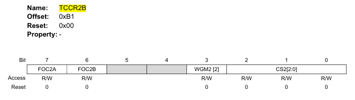

# Week: 1 - Goal : 1


## Objective 6: Refresh your microcontroller know-how

### Task Checklist & Results

| Task ID   | Type       | Status / Deliverable
| :---      | :---       | :--- 
| **[161]** | `CORE`     | [x] Completed
| **[162]** | `CORE`     | [x] Completed
| **[163]** | `CORE`     | [x] Completed
| **[164]** | `CORE`     | [x] Completed
| **[165]** | `CORE`     | [x] Completed
| **[166]** | `OPTIONAL` | [x] Completed
| **[167]** | `OPTIONAL` | [x] Completed
| **[168]** | `OPTIONAL` | [] Completed

---

#### Task 161
> **Question/Prompt:** Usually a microcontroller (MCU) comes with a datasheet explaining how it works and different other specifications which engineers are looking for understanding them. Go to ATmega324PB datasheet and familiarize yourself with the block diagram showing the internal components as blocks, with external pinout and finally with the CPU core. Try to identify what is interesting for you or makes you curious about.

> **Answer/Explanation:**

---

#### Task 162
> **Question/Prompt:** Check the endian architecture of ATMega324PB microcontroller (is it little endian or big endian?). Re-write the first program code (the one with the sum) and assign to variable b the value 257, then compile again, download and run your program and you should see the sum to be 258 or 0x0102 in hexadecimal. Now open a Watch window and a Memory window and compare the content from variable c address. Is it the same?

> **Answer/Explanation:**
> The sum of a and b is 258 or 0x0102. In the watch window, the result is shown as 0102, but in memory it's stored as 02 01. That means that ATMega324PB is a little endian architecture.

---

#### Task 163
> **Question/Prompt:** Open the datasheet of the ATMega324PB microcontroller and find the register TCCR2B, a real register!!! Compare the information found in the datasheet with the macro of the register TCCR2B. What is your conclusion?

> **Answer/Explanation:**
> The Timer/Counter Control Register B (TCCR2B) consists of 8 bits:



> The macro has the following structure:  SFR_B_N(0xB1, TCCR2B, FOC2A, FOC2B, Dummy5, Dummy4, WGM22, CS22, CS21, CS20)

> Based on the structure of the register and the macro the conclusion is that the macro directly maps the software definition to the exact physical structure of the hardware register.

---

#### Task 164
> **Question/Prompt:**  By analogy with the expansion example above, write in the main.c file as comments (!) how you understood the following macro registers will be expanded:

```
SFR_B_N(0x08,PORTC,PORTC7,PORTC6,PORTC5,PORTC4,PORTC3,PORTC2,PORTC1,PORTC0)
SFR_B_N(0x07, DDRC, DDRC7, DDRC6, DDRC5, DDRC4, DDRC3, DDRC2, DDRC1, DDRC0)
SFR_B_N(0x06, PINC, PINC7, PINC6, PINC5, PINC4, PINC3, PINC2, PINC1, PINC0)
```

> **Answer/Explanation:**

```
#include <iom324pb.h>

void main(void)
{  
 /* SFR_B_N(0x08,PORTC,PORTC7,PORTC6,PORTC5,PORTC4,PORTC3,PORTC2,PORTC1,PORTC0)
 *  Expands to:
 *  __io union { 
 *              - byte level access
 *              unsigned char PORTC; 
 *
 *              - generic bit level
 *              struct { 
 *                      unsigned char PORTC_Bit0:1, 
 *                                    PORTC_Bit1:1, 
 *                                    PORTC_Bit2:1, 
 *                                    PORTC_Bit3:1, 
 *                                    PORTC_Bit4:1, 
 *                                    PORTC_Bit5:1, 
 *                                    PORTC_Bit6:1, 
 *                                    PORTC_Bit7:1; 
 *                     }; 
 *              - specific bit-name level
 *              struct { 
 *                      unsigned char PORTC_PORTC0:1, 
 *                                    PORTC_PORTC1:1, 
 *                                    PORTC_PORTC2:1, 
 *                                    PORTC_PORTC3:1, 
 *                                    PORTC_PORTC4:1, 
 *                                    PORTC_PORTC5:1, 
 *                                    PORTC_PORTC6:1, 
 *                                    PORTC_PORTC7:1; 
 *                     }; 
 *             } @ 0x08;
 *
 * this same expansion happens to the other two macros
 * we just need to switch:
 *      - PORTC with DDRC and PINC
 *      - PORTC_ Bit/PORTC [0-7] with DDRC_ Bit/DDRC [0-7] and PINC_ Bit/PINC [0-7]
 *      - 0x08 with 0x07 and 0x06
 */
}
```

---

#### Task 165
> **Question/Prompt:**  Include the header file iom324pb.h in your main.c file. Compile. Check with preprocessed files (main.i) how the macros or #defines are expanded. Is this confirming your knowledge acquired so far? How the comments are preprocessed?

> **Answer/Explanation:**
> After I included the header file and compiled the source code, the macros expanded just as expected after doing the previous task. 
> The comments were stripped from the file by the preprocessor, since there was no option chosen to keep them.

---

#### Task 166
> **Question/Prompt:**  Compare contents of the file iom324PB.h vs. datasheet microcontroller vs. register view of IAR EW. What is your conclusion?

> **Answer/Explanation:**

| Register | Size (bits) | Datasheet address (offset) | iom324pb.h definition matches? | IAR register view matches?
| :---     | :---        | :---                       | :---                           | :--- 
| TIFR4    | 8           | 0x39                       | Yes                            | Yes 
| SPSR0    | 8           | 0x4D                       | Yes                            | Yes 
| PINE     | 8           | 0x2C                       | Yes                            | Yes 

> As demonstrared in the table above, there is a correlation between the hardware registers, macros and the IDE.
> The hardware specs from the datasheet are translated into software inside the `iom344pb.h` file, whic the registers view the uses to display the hardware states during debugging. 

---

#### Task 167
> **Question/Prompt:**  Can you find the same 3 registers in the ATmega328PB (search the internet for ATmega328PB datasheet and the iom328pb.h file in the same manner you found iom324pb.h)? If YES, then this means you can write portable code, the same code works for both microcontrollers, ATmega324PB and ATmega328PB.

> **Answer/Explanation:**
> I looked at the datasheets and inside the `iom324pb.h` and `iom328pb.h` files:

```
// iom328pb.h for TIFR4
SFR_B_N(0x19, TIFR4, Dummy7, Dummy6, ICF4, Dummy4, Dummy3, OCF4B, OCF4A, TOV4)
// iom324pb.h for TIFR4
SFR_B_N(0x19, TIFR4, Dummy7, Dummy6, ICF4, Dummy4, Dummy3, OCF4B, OCF4A, TOV4)

// iom328pb.h for SPSR0 
SFR_B_N(0x2D, SPSR0, SPIF, WCOL, Dummy5, Dummy4, Dummy3, Dummy2, Dummy1, SPI2X)
// iom324pb.h for SPSR0 
SFR_B_N(0x2D, SPSR0, SPIF, WCOL, Dummy5, Dummy4, Dummy3, Dummy2, Dummy1, SPI2X)

// iom328pb.h for PINE
SFR_B_N(0x0C, PINE, Dummy7, Dummy6, Dummy5, Dummy4, PINE3, PINE2, PINE1, PINE0)
// iom324pb.h for PINE
SFR_B_N(0x0C, PINE, Dummy7, PINE6, PINE5, PINE4, PINE3, PINE2, PINE1, PINE0)
```

> I did find the same registers for both chips, but because of differences in registers like `PINE`, we cannot write the same exact code and expect it to work identically on both microcontrollers.

---

#### Task 168
> **Question/Prompt:**  

> **Answer/Explanation:**

---

## References & Resources
* AVR Microcontroller with Core Independent Peripherals and PicoPower technology (ATMega324PB)
* AVR Microcontroller with Core Independent Peripherals and PicoPower technology (ATMega328PB)