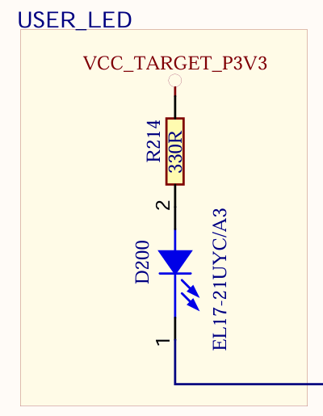
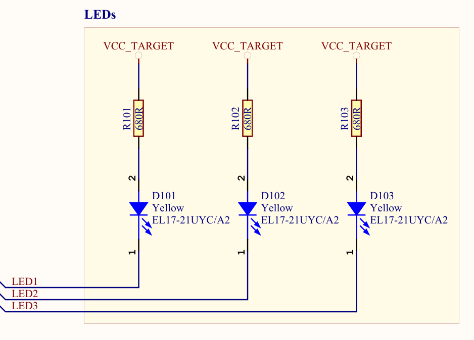
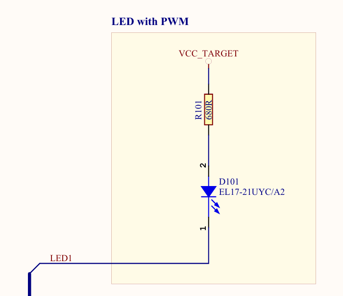

# Week: 1 - Goal : 2

## Objective 2: Turn on external LEDs
---

### Task Checklist & Results

| Task ID   | Type   | Status
| :---      | :---   | :--- 
| **[221]** | `CORE` | [x] Completed 
| **[222]** | `CORE` | [x] Completed 

---

#### Task 221
> **Question/Prompt:** Check the electronic schematic of the ATMega324PB development board. Is there any resistor connected with the integrated LED0 in order to protect it? What value has that resistor?

> **Answer/Explanation:**
> There is a current limiting resistor connected in series with the LED to protect it from burning. R214 has a value of 330 ohms.

---

#### Task 222
> **Question/Prompt:**  In Reference_Documents folder you find the electronic schematics for OLED1 and IO1 boards (check .zip files). Can you figure it out, just by reading the schematics (NOT the User Guide!!!), how to turn on the contained LEDs for each board?

> **Answer/Explanation:**
> Both schematics show the same exact hardware configuration for driving the LED, which is known as an active low configuration:

> 1. The top of each LED circuit is connect to VCC (labeled VCC_TARGET), which is the constant positive voltage supply.
> 2. Current flows from VCC through a resistor with a value of 680 ohms (R101, R102, R103). This resistor is critical to prevent the LED from burning.
> 3. The current enters pin 2 (the anode) and exits through pin 1 (cathode).
> 4. The cathode is directly tied to the microcontroller control lines (LED1, LED2, LED3).
>
> To turn the LEDs on, the microcontroller pins connected to LED1, LED2, and LED3 must be configured as outputs and driven to LOW.
> When the pins are LOW, a voltage potential is created between VCC and the microcontroller pins. Current then flows from the power supply, through the resistor, through the LED and lighting it up, and lastly it sinks directly into the microcontroller pin to GND.

> Even tough the physical hardware wiring looks the same, I assume that there must be a slight difference between the two boards, since the LEDs on the OLED board work just as encounterd before in this week's goals, but the LED on the IO1 board uses pulse width modulation (PWM).

---

## References & Resources
* ATmega324PB Xplained Pro Schematics
* IO1 Xplained Pro design documentation
* OLED Xplained Pro design documentation
