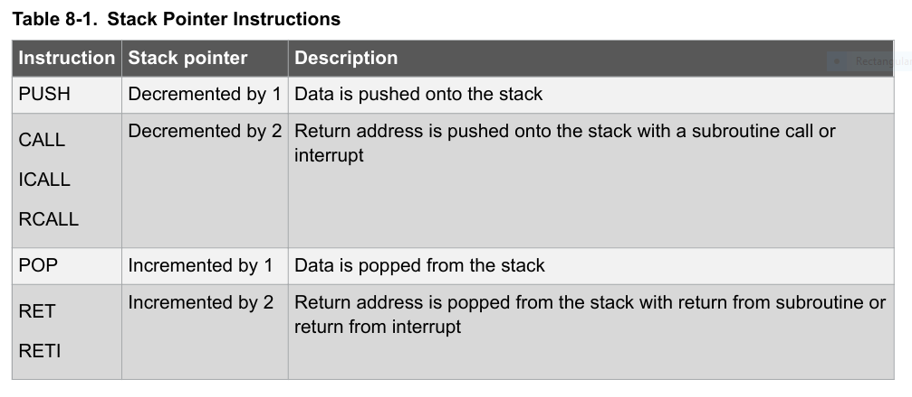

# Week: 2 - Goal : 3


## Objective 1: "Hello" interrupts!

---

### Task Checklist & Results

| Task ID   | Type   | Status 
| :---      | :---   | :---                    
| **[311]** | `CORE` | [x] Completed 
| **[312]** | `CORE` | [x] Completed 
| **[313]** | `CORE` | [x] Completed 
| **[314]** | `CORE` | [x] Completed 

--- 

#### Task 311
> **Question/Prompt:** With this objective we introduce the interrupts, THE big idea in embedded systems :) A microcontroller can implement many sources/triggers of interrupts for its processor (CPU). One simple interrupt can be the one triggered by the push of an external button. So you push the button and a signal is sent through the registers way up until it reaches the CPU. That signal is the interrupt request. Keep in mind this short idea:

> button pressed > pin voltage level changed > interrupt request to CPU

> when studying from the microcontroller's datasheet the interrupts for your personal understanding. Be aware you will encounter a lot of information noise, but you have to filter it out... so keep focus on what you have to find to program the interrupts triggered by your button press.

> Study:

- [x] chapter 8.1 on how interrupts are implemented
- [x] chapter 8.3.1 on the Global Interrupt Enable bit effect
- [x] chapter 8.5 on the link between Stack Pointer and interrupts
- [x] chapter 8.8 and down the page chapter 8.8.1 on the behavior of interrupts
- [x] chapter 14.1 on the Interrupt Vector Table (just the table!!!)
- [x] chapter 15 on the external interrupts mechanism and registers description
- [x] chapter 6 table for pin identification

> **Answer/Explanation:**
> 1. How are interrupts implemented?
> 
> #### interrupts and ivt
> - An interrupt vector table (IVT) is a dedicated table of memory addresses (vectors) located at the very beginning of the program memory. Each interrupt has its own predefined slot.
> - The priority of an interrupt is determined by the physical position of the interrupt's vector in the IVT:
>   - the lower the address, the higher the priority
> - For an interrupt to be recognized, it must be enabled in its specific control register, and the global interrupt enable bit in the status register must be set to 1.
> 
> #### interrupt behavior
> - When a hardware event triggers an enabled interrupt, the CPU finishes its current instruction. 
> - Before jumping to handle the interrupt, the CPU must know where to return afterward:
>   - it takes the current address in the PC (the return address) and stores it onto the stack in SRAM
> - The CPU loads the address of the corresponding interrupt vector into the PC and jumps there. This vector typically contains a jump instruction to the ISR (the code that handles the event).
> - By default, when entering an ISR, the AVR temporarily blocks additional interrupts.
> - At the end of the ISR, the RETI instruction is executed:
>   - the return address is popped from the stack back into PC
>   - it sets the global interrupt enable bit back to 1 so the CPU can receive interrupts again

> 2. The Global Interrupt Enable bit
> #### status register
> - The status register (SREG) is an 8 bit register that serves two primary purposes:
>   - reporting: it holds flags that tell the result of the most recent arithmetic or logical operation
>   - control: it contains a cruciat bit that controls whether the microcontroller is allowed to process interrupts

> #### global interrupt enable
> - The global interrupt enable bit must be set for interrupts to be enabled. 
> - This bit is cleared by the hardware after an interrupt has occured, and is set by the RETI to enable subsequent interrupts.

> 3. Stack pointer and interrupts
> #### stack 
> - The stack is mainly used for storing temporary data (such as local variables and return addreses). It grows from highest to lowest memory locations:
>   - push on stack means the microcontroller writes data to the current addres, and then the stack pointer decreases
>   - pop from stack means that the stack pointer increases back up
> - The stack pointer register always points to the top of the stack.
> 
> #### stack pointer & interrupts
> - When an event happens, the program counter is pushed on the stack to serve as the return address. After it was handled, the return address is popped from the stack. During these steps, the stack register goes thorugh these instructions:



> 4. Behavior of interrupts 
> #### enablement & priority
> - To trigger an interrupt, both its individual enable bit and the global interrupt enable bit in the status register must be set to 1.
> - Each interrupt has a dedicated vector (address) at the bottom of the program memory. The lower the address, the higher the priority.
>
> #### types 
> 1. triggered by an event that sets an interrupt flag
> 2. triggered only as long as the physical condition is active
>
> #### the execution cycle
> - entering the interrupt:
>   - global bit cleared
>   - PC pushed to on stack
>   - nesting can be done if we need to interrupt the current execution cycle
>   - the SREG isn't stored by the hardware. It is manually saved and restore
> - existing the interrupt:
>   - RETI is executed
>   - PC popped from the stack
>   - global bit set
>   - CPU resumed program
>
> #### the execution cycle
> The timing behavior during an interrupt sequence is strictly measured in CPU clock cycles: 

| Stage                 | Duration    
| :---                  | :---                      
| Response delay        | 4 clock cycles (min)
| Vector jump           | 3 clock cycles 
| Sleep mode penalty    | +4 clock cycles 
| RETI                  | 4 clock cycles 

> 5. External interrupts
> - Triggered by dedicated INT pins or PCINT (pin change interrupt) pins.
> - Even if these pins are configured as outputs, changing their state in code will still trigger the interrupt. This allows to generate interrupts purely via software.
> - Because the I/O clock is halted in all sleep modes except IDLE:
>   - rising/falling edge cannoe be triggered on INT pins to wake up from deep sleep
>   - PCINT or low level trigger on INT pins (with additional issues) need to be used for deep sleep wake-ups

---

#### Task 312
> **Question/Prompt:** Identify and double check within iom324pb.h that the interrupt vector table is implemented correctly. Go to Compiler Guide (from IAR Embedded Workbench HELP) and read for:

- [x] INTERRUPT FUNCTIONS (pag.64)
- [x] RESTRICTIONS FOR SPECIAL FUNCTION TYPES => Interrupt functions (pag.163)
- [x] __interrupt keyword (pag. 307)

> **Answer/Explanation:**
> The interrupt vector table from the header follows the structure of the table featured in the datasheet, with a few naming differences between some vectors.
>
> The main "difference" is the addressing:
> - the datasheet uses word addresses, which are 2 bytes wide: 0x0002
> - the compiler header uses byte addresses: 0x04
> To convert a word address to a byte address:

```math
word\,address\,(0x0002) * 2 = byte\,address\,(0x0004)
```

> #### Interrupt vectors and the interrupt vector table
> For the AVR microcontroller, the interrupt vector table always starts at the address 0x0 and is placed in the INTVEC segment. The interrupt vector is the offset into the interrupt vector table. The interrupt vector table contains pointers to interrupt routines, including the reset routine. The AT90S80515 device has 13 interrupt vectors and one reset vector. For this reason, you should specify 14 interrupt vectors, each of two bytes.
>
> If a vector is specified in the definition of an interrupt function, the processor interrupt vector table is populated. It is also possible to define an interrupt function without a vector. This is useful if an application is capable of populating or changing the interrupt vector table at runtime.
>
> ####  Defining an interrupt function—an example
> To define an interrupt function, the _ _interrupt keyword and the `#pragma` vector directive can be used. For example:

```c
#pragma vector = 0x14
__interrupt void MyInterruptRoutine(void)
{  
    /* Do something */
}
```

> The `__interrupt` keyword specifies interrupt functions. To specify one or several interrupt vectors, use the `#pragma` vector directive. The range of the interrupt vectors depends on the device used. It is possible to define an interrupt function without a vector, but then the compiler will not generate an entry in the interrupt vector table.
>
> The header file `iodevice.h`, where device corresponds to the selected device, contains predefined names for the existing interrupt vectors.
>
> To make sure that the interrupt handler executes as fast as possible, you should compile it with -Ohs, or use #pragma optimize=speed if the module is compiled with another optimization goal.
>
> Note:  
> An interrupt function must have the return type void, and it cannot specify any parameters.

```c
void handler(void)
{
    // handler implementation
}
```

> #### Interrupt and C++ member functions
> Only static member functions can be interrupt functions.

---

#### Task 313
> **Question/Prompt:** As your understanding over interrupts grows it is time to introduce the routine executed by the CPU when it will be interrupted by the external request. So remember the sequence:

> button pressed > pin voltage level changed > interrupt request to CPU > jump to vector > executes routine written by you

> Our IAR compiler (like any other compiler) uses a special construct to mark the function written by you in C language as being the routine executed by the CPU in case of interrupt request. Remember that saying it is a FUNCTION is improper/wrong, the correct saying is INTERRUPT SERVICE ROUTINE, on short ISR. It is a routine and not a function for some simple reasons: it does not have input parameters, does not return anything and it is not called (!!!) like a normal function is called within the program. The amount of code you write inside ISR should be kept small. Below is an example of what you should write (between #pragma and the ISR name you MUST NOT introduce any other line of code!!! as the compiler after the #pragma is strictly expecting to encounter the routine name!):

```c
#pragma vector=INT2_vect
__interrupt void my_routine(void)
/* the amazing routine for serving the interrupt caused by my button press */
{
    /* some code here… e.g. you can turn ON the LED0 here  */
}
```

> **Answer/Explanation:**
> For the previous sequence, the steps will be:
> 1. button pressed => the pin goes from HIGH TO LOW
> 2. pin voltage change => the EXTI detects it (based on EICRA configuration)
> 3. interrupt request to CPU => CPU saves program state and jumps to hardware defined memory address for that interrupt
> 4. jump to vector => at the vector tablea address, the compiler placed a jump instruction to routine
> 5. executes routine written by you => 

---

#### Task 314
> **Question/Prompt:** Establish what kind of settings you should do for the registers supporting external interrupts, knowing the connection between SW0 and microcontroller's pin. Adapt also the interrupt vector name (above it was just an example).

> **Answer/Explanation:**
> The button is connected to PC6, which has an alternate function PCINT22. So the pin will be configured using pin change interrupt, not an INT.
>
> - Configure PC6 as an input with pull-up.
> - Set the PCIE2 pin in the PCICR register.
> - Set the PCINT22 bit (6) in the PCMSK2 register.

```c
#pragma vector = PCINT2_vect
__interrupt void button_press_routine(void)
{
    if (!button_read(BUTTON_ONBOARD))
    {
        led_power_on(LED_ONBOARD);
    }
    else
    {
        led_power_off(LED_ONBOARD);
    }
}
```

---

## References & Resources
* AVR Microcontroller with Core Independent Peripherals and PicoPower technology (ATmega324PB)
* IAR Embedded Workbench IDE online help
* ATmega324PB Xplained Pro user guide