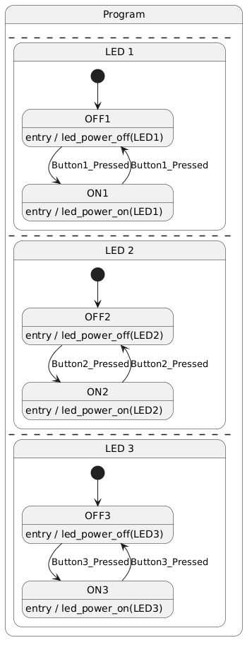

# Week: 3 - Goal : 6

## Objective 6: Understanding State Machines (SM)

---

### Task Checklist & Results

| Task ID   | Type       | Status
| :---      | :---       | :--- 
| **[661]** | `STRETCH`  | [] Completed
| **[662]** | `STRETCH`  | [] Completed
| **[663]** | `CORE`     | [x] Completed
| **[664]** | `CORE`     | [x] Completed

---

#### Task 661
> **Question/Prompt:** State machines ease programming microcontrollers - EDN

> **Answer/Explanation:**
> 

---

#### Task 662
> **Question/Prompt:** What is a state machine? (itemis.com)

> **Answer/Explanation:**
> 

---

#### Task 663
> **Question/Prompt:** As a summarization, the main elements of State Machines are STATES, EVENTS and TRANSITIONS which are executed based on some GUARDS conditions. When arriving in a particular state, then an ACTION/OUTPUT has to be performed. For OLED1 board imagine the following scenario:

> - each button X (X = 1,2,3) when pressed will determine the corresponding LED X (X = 1,2,3) to be turned on
> - when pressed a second time, the button X will turn off the corresponding LED X
>
> Identify in a list (not implement yet!) the key elements of a state machine in the described scenario (look for STATES, TRANSITIONS, GUARD CONDITIONS, ACTIONS/OUTPUTS).

> **Answer/Explanation:**
> 1. STATES:
> For each button/LED pair X (X = 1, 2, 3), the system has exactly two states:
> - LED_X_OFF — LED X is not illuminated
> - LED_X_ON  — LED X is illuminated
>
> Since there are 3 independent button/LED pairs, this is an independent state machines (one per pair) since each button only ever affects its own LED, never the others.
>
> 2. EVENTS:
> Button X Pressed. This is the only event that drives any transition in this scenario.
> 
> 3. TRANSITIONS:
> - LED_X_OFF -> LED_X_ON, triggered by Button X Pressed
> - LED_X_ON  -> LED_X_OFF, triggered by Button X Pressed 
>
> 4. GUARD CONDITIONS:
> None required.
>
> 5. ACTIONS / OUTPUTS
> - On entering LED_X_ON: led_power_on(LED_X)
> - On entering LED_X_OFF: led_power_off(LED_X)

---

#### Task 664
> **Question/Prompt:** Use an UML STATE MACHINE DIAGRAM to describe/capture the elements identified previously. e.g. online tools: draw.io.

> **Answer/Explanation:**

---