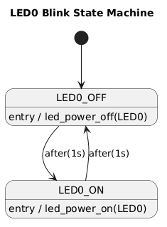

# Week: 3 - Goal : 6


## Objective 7: Implementing State Machines

---

### Task Checklist & Results

| Task ID   | Type       | Status
| :---      | :---       | :--- 
| **[671]** | `CORE`     | [x] Completed
| **[672]** | `CORE`     | [x] Completed

---

#### Task 671
> **Question/Prompt:**  To implement the state machine description into C programming language we should consider the following:
>
> - implementation using nested IFs statements
> - implementation using SWITCH statement
> - implementation using POINTERS to FUNCTIONS
>
> We can also consider the following correspondence State Machine key elements - C constructs:
>
> - STATES are usually kept into variables in C (some preference exists for enums as they keep an automatic numbering for the considered states)
> - EVENTS are usually implemented like enums or simple variables
> - TRANSITIONS are associated with a SWITCH structure (contained in the function handling the transitions) and the GUARD condition that must be met is checked with IF statement
> - ACTIONS/OUTPUTS are all normal C code statements that have to be executed for that specific state (e.g. turn on LED)
>
> All things considered, even if you are designing a state machine as a way to better organize your code, this will not exclude the usage of a task scheduler (since the events and guard conditions will be checked constantly). In this way you have a very powerful combination between task scheduler and state machines as design concepts for any embedded systems application.

> **Answer/Explanation:**
> 

---

#### Task 671
> **Question/Prompt:**  Consider LED0 with blinking behavior (ON 1sec, OFF 1 sec) implemented with IFs like in the example below. Use draw.io to draw UML State Machine diagram for it. Then re-write the code using the Task Scheduler and your own State Machine to drive the behavior described.

> **Answer/Explanation:**



```c
typedef enum
{
    LED_STATE_OFF = 0,
    LED_STATE_ON
} led_state_t;
```

```c
void led_state_machine_update(void)
{
    static led_state_t state = LED_STATE_OFF;

    switch (state)
    {
    case LED_STATE_OFF:
        led_power_on(LED_ONBOARD);
        state = LED_STATE_ON;
        break;

    case LED_STATE_ON:
        led_power_off(LED_ONBOARD);
        state = LED_STATE_OFF;
        break;
    }
}
```

```c
void task_1000ms(void)
{
    led_state_machine_update();
}

```

---
