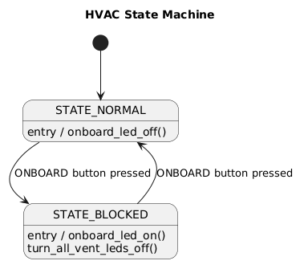
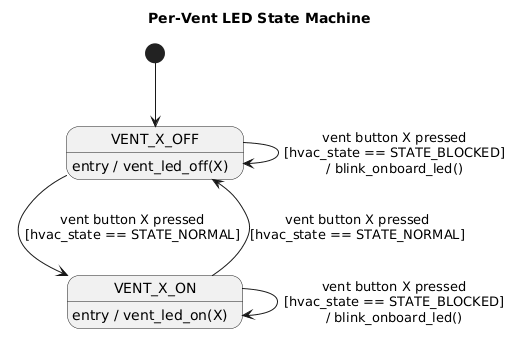

# Week: 3 - Goal : 6

## Objective 8: Control Panel Application RE-REVISITED

---

### Task Checklist & Results

| Task ID   | Type       | Status
| :---      | :---       | :--- 
| **[681]** | `CORE`     | [x] Completed

---

#### Task 681
> **Question/Prompt:** Go to BMW Control Panel Application and refactor the code using State Machine concept:
> - identify key-elements
> - draw State Machine diagram
> - implement State Machine

> **Answer/Explanation:**
> 1. HVAC state:
> - STATES: 
>   - STATE_NORMAL
>   - STATE_BLOCKED
> - EVENT: 
    - ONBOARD button is PRESSED
> - TRANSITIONS: 
>   - NORMAL -> BLOCKED
>   - BLOCKED -> NORMAL
> - GUARD CONDITIONS: NONE
> - ACTIONS(ON ENTRY): 
>   - entering BLOCKED -> turn ONBOARD LED ON, turn all vents OFF
>   - entering NORMAL -> turn ONBOARD LED OFF

> 2. vent LED state (one instance per vent button X = 1, 2, 3)
> - STATES: 
>   - VENT_X_OFF
>   - VENT_X_ON
> - EVENT: 
>   - vent button X is PRESSED
> - GUARD CONDITIONS: hvac_state = STATE_NORMAL
> - TRANSITIONS: 
>   - VENT_X_OFF -> VENT_X_ON and back, guarded by the condition above

---
